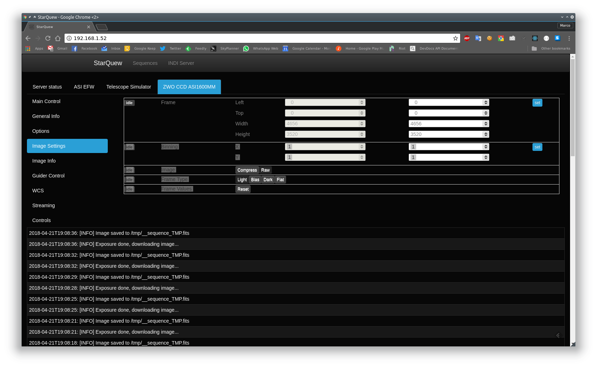
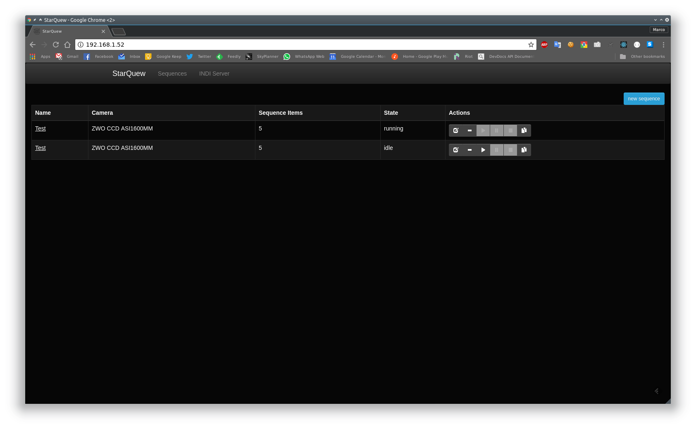
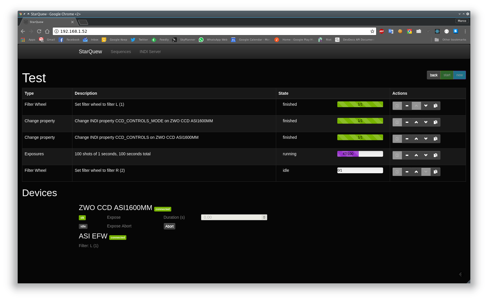
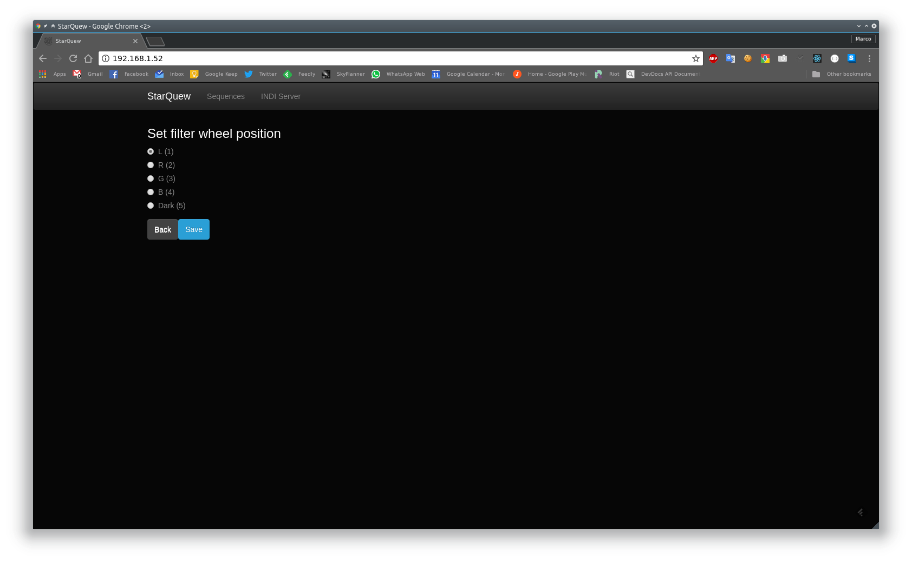
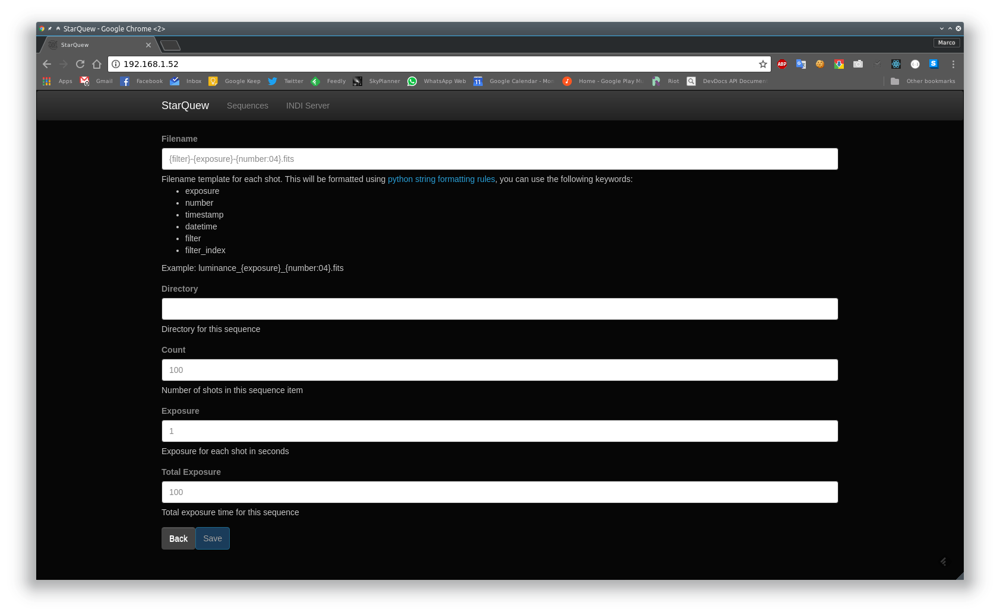
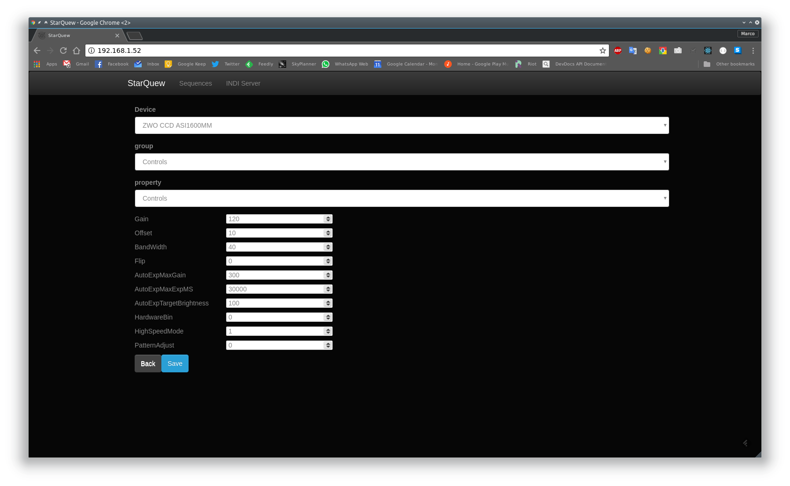

# StarQuew - Astrophotography sequence server

A lightweight, web based sequence generator and INDI client written in Python and React.

*StarQuew* allows you to start and manage an astrophotography sequence directly from your browser, even remotely by using the now very popular SoC boards such as the Raspberry Pi.

Right now it provides an INDI control panel, and a sequence management interface allowing you to control camera, filter wheel and other properties, and it is then perfect for lightweight setups using a Raspberry Pi as shooting board, a star tracker (Star Adventurer and similar) and a CMOS/CCD camera.

In the future I also plan to support telescope interfaces (GOTO/tracking), direct image preview, focus helpers, plate solving, and possibly autoguiding using PHD2 APIs.

## Get the sources

Run the following command:
```
git clone --recurse-submodules https://github.com/GuLinux/StarQuew
```
Note: the `--recurse-submodules` is important since the repository contains a link to another repository.
Similarly, when updating the repository you need to specify the parameter again:

```
git pull --recurse-submodules
```

## Install

Please refer to [docs/INSTALL.md](docs/INSTALL.md) for an installation walkthrough.


## Deploy via Docker

Refer to [docs/INSTALL-Docker.md](docs/INSTALL-Docker.md).

## Screenshots









## Credits

Icon: [Space Exploration Set](https://www.iconfinder.com/icons/3088382/astronomy_galaxy_space_star_universe_icon#size=256)


